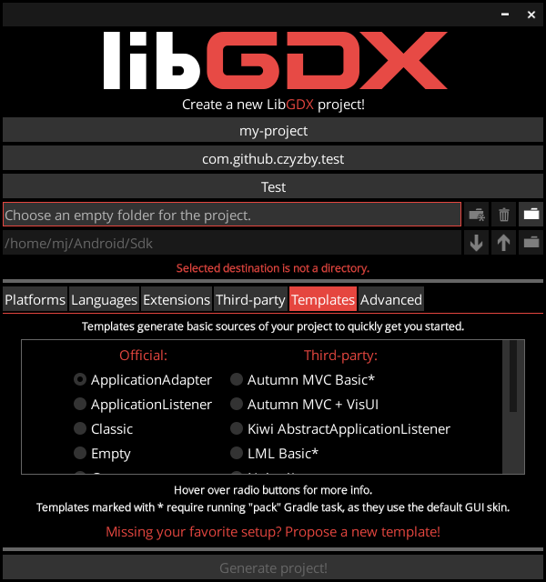

# gdx-setup

Work in progress. This is meant to be a replacement for the current `gdx-setup` application, which... well, has its flaws. The biggest of which is *Swing* usage.

Additionally to supporting most official `gdx-setup` features, you might want to consider switching because of:
- Project templates. You can choose the initial generated sources of the project - you're no longer forced to use `ApplicationAdapter` and BadLogic logo. (No offence, guys!)
- Input validation. Your project data is validated as you type it in.
- Other JVM languages support. You can choose additional languages for your project - their runtime libraries, Gradle plugins and source folders will be included.
- Assets folder is now in the root directory and is properly linked by all projects. No more missing resources for the desktop project.
- Much more settings. You have more control over the versions of software used by your application.
- More third-party extensions.
- Preferences, favorites. Basic data of your application is saved, so you don't have to fill it each time you generate a project. File chooser allows you to add your "favorite" workspace folders.
- Internationalization! The application can be translated to different languages. It's currently available in English and Polish.
- Gradle wrapper and running Gradle tasks after generation is entirely optional. This can significantly speed up the generation process and limit the project size if you'd prefer to use a globally installed Gradle application.
- There are no major *structural differences* between any generated projects, regardless of the platforms you initially used. Official `gdx-setup` puts assets in `android` or - if Android platform is not supported - `core` folders. If you don't start with the Android platform, adding it to an existing project would require a lot of moving around and modifying Gradle scripts. Usually you'd be better off just generating a new project and moving the code. On contrary, this application puts `assets` in the *root* folder - adding a new platform to an existing application *never* requires you to modify any of the other platforms, you just have to add the new project to `settings.gradle` and create its directory.

Currently missing:
- iOS MOE platform support. iOS RoboVM platform is supported, though.

### Running the application

You can download the latest runnable jar [here](https://dl.kotcrab.com/libgdx/gdx-setup-latest.jar). Stable application versions are uploaded to the [releases section](https://github.com/czyzby/gdx-setup/releases).

#### Running from sources

```
git clone https://github.com/czyzby/gdx-setup.git
cd gdx-setup
gradle run
```

*Pro tip*: check the `Generate skin assets` option in `Advanced` tab and `Desktop` in `Platforms` tab. Enter `pack desktop:run --daemon` Gradle tasks in `Advanced` tab. Delete project directory with the trash icon after each run. Now you can easily test all templates one by one.



## Contributing

You can start with creating an issue: if that's something trivial like adding a new extension or updating some version, it will most likely be quickly resolved. If you want to modify the sources and pull a request, check out [contribution guide](CONTRIBUTING.md).
